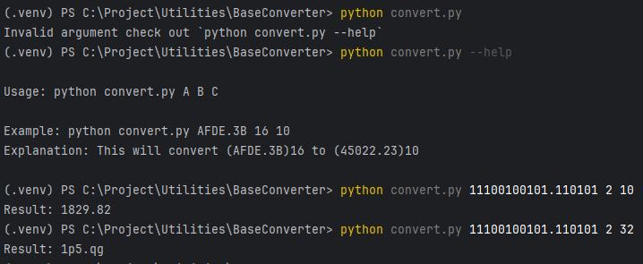

# Base Converter CLI in python.

In this Base converter i have tried to keep components separate and reusable, you can freely make use of 
functions in your program. This base converter can also handle fraction values but its precision still isn't
that reliable.

Script only has two commands you can look at the image below.

## Note:
Inspired by https://github.com/mattrltrent/base_converter.

